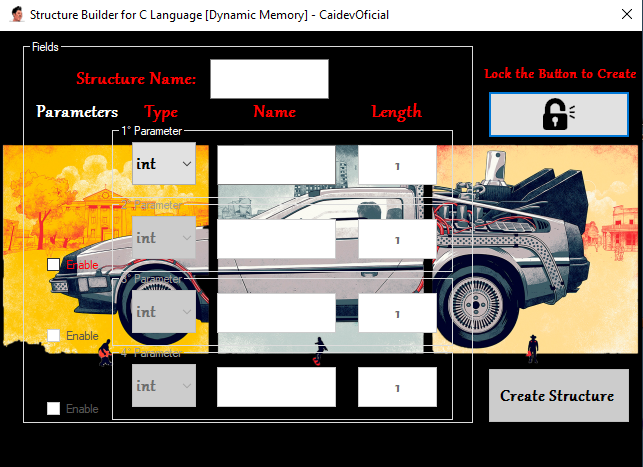
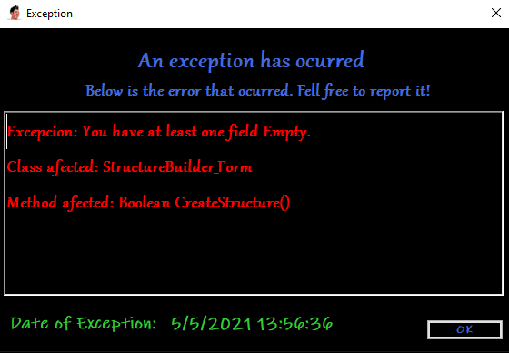

<table>
  <tr>
  <td></td>
  </tr>
</table></br>


---

<p align="left">  </p>

<p align="left"> <a href="https://github.com/CaidevOficial"></a> </p>

---

# C# Structure Builder for C Language (Dynamic Memory). 👨‍💻
---


<table>
  <th>App UI</th><th>Exception Form</th>
  <tr>
    <td>
      
    </td>
    <td>
      
    </td>
  </tr>
</table>

---

<details>
  <summary>:zap: GitHub Stats</summary>
    <br><br>
</details>

<details>
    <summary>:zap: Most Used Languages</summary>
    <br>
</details>

---

```C#
public static void ShowNewSkill(){
    string message = "Upgrading my skills [C# Version!]";
    Console.WriteLine(message);
}
```
---

## Technologies used. 📌
|<a href="https://docs.microsoft.com/es-es/dotnet/csharp/">|<h3>C#</h3>|
|--------|----------|

---

## License 📄
This project is under license \[MIT License\] - read the file [LICENSE.md](LICENSE) for details.

---

## Where to find me: 🌎
|||
|------------|------------|
|🤴 Facu Falcone|Junior Developer|
||<center><a href="https://github.com/caidevOficial/">Github</a></center>|
||<a href="https://www.linkedin.com/in/facundo-falcone/">LinkedIn</a>|
||<a href="https://cafecito.app/caidevoficial/">CafecitoApp</a>|
