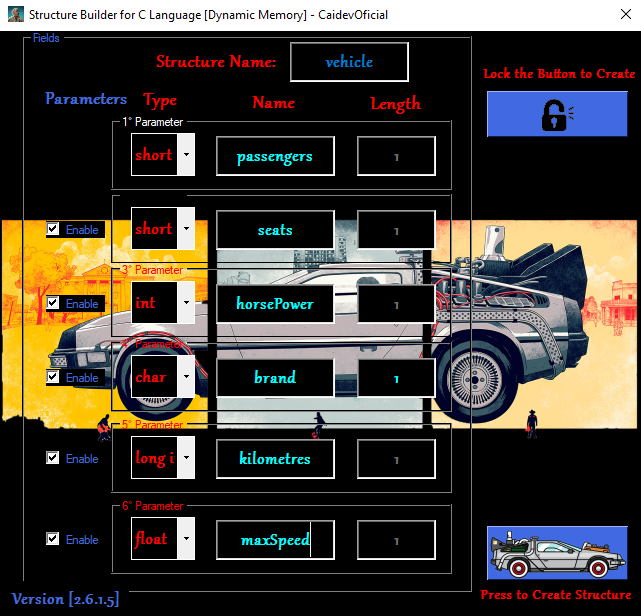
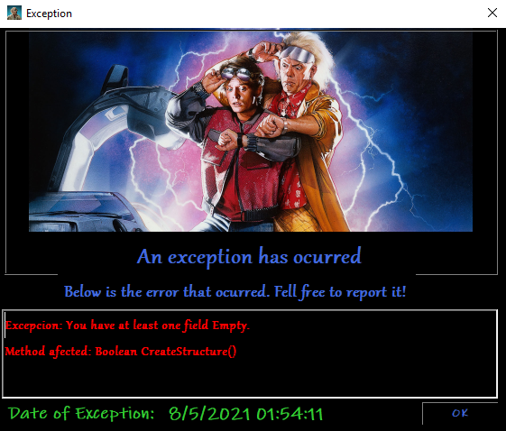
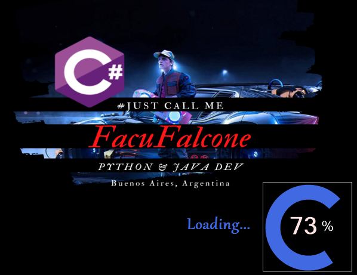
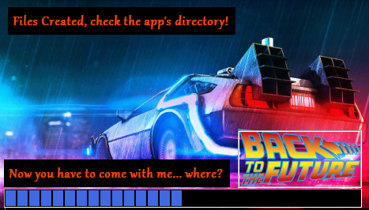

<table align='center'>
  <tr>
    <td>
            
        </td>
  <td></td>
  </tr>
</table></br>

<div align="center">
    <h3>Pisces♓ | Developer👨‍💻 | Python | GCP  | Java  | C#  | Dreamer 💖 | Teacher👨‍🏫| A bit nerd🤓</h3>
    <br>
    <h3>📌 Programming Student & Assistant Professor at the <br>
    <strong>National Technological University [UTN]</strong> 👨‍💻</h3>
    <h3>📌 Backend programmer at <strong>Accenture</strong> 👨‍💻</h3>
</div>


<p align="center">
    
</p>

<p align="center">
    <a href="https://github.com/CaidevOficial">
        
    </a>
</p>
<br><br><br>

---

<br>


<table align='center'>
    <theader>
        <th><h2><center>Watch this little video Demo on 🎥</center></h2></th>
    </theader>
    <tbody>
        <tr>
        <td>
            <a href="https://www.youtube.com/watch?v=TJgePq9AsAo" target="_blank">
                <center>
                    
                </center>
            </a>
        </td>
    </tr>
    </tbody>
</table>

<br><br><br>

# C# Structure Builder for C Language (Dynamic Memory). 👨‍💻

This program allows you to create basic files necessary for structures in the 'C' language [for dynamic memory]. By writing the names of the structure and parameters, as well as their types and length (in the case of a parameter of type 'char'), it will create a file with extension '.h' for the libraries and a file with extension ' .c' with the code in question in a folder in Desktop.
---


<table>
  <th>App GUI</th><th>Exception Form</th><th>Loading Screen</th><th>Success Screen</th>
  <tr>
    <td>
      
    </td>
    <td>
      
    </td>
    <td>
      
    </td>
    <td>
      
    </td>
  </tr>
</table>

---

<details>
  <summary>:zap: GitHub Stats</summary>
    <br><br>
</details>

<details>
    <summary>:zap: Most Used Languages</summary>
    <br>
</details>

---

```C#
public static void ShowNewSkill(){
    string message = "Upgrading my skills [C# Version!]";
    Console.WriteLine(message);
}
```
---


# More Links 📌

You can also try others versions of this software coded in other languages, such as:

<table align='center'>
    <tbody>
        <tr>
            <td>
                
            </td>
            <td>
                <a href="https://github.com/caidevOficial/Python_StructureBuilder/">Python</a>
            </td>
        </tr>
        <tr>
            <td>
                
            </td>
            <td>
                <a href="https://github.com/CaidevOficial/Java_StructureBuilder_forC/">Java</a>
            </td>
        </tr>
    </tbody>
</table>

---

</br>
<table align='center'>
    <tr align='center'>
        <h2 align='center'>Technologies used. 📌</h2>
        <td>
            <a href="https://docs.microsoft.com/es-es/dotnet/csharp/"></a>
        </td>
        <td><center>Python</center></td>
    </tr>
    <tr align='center'>
        <td>
            <a href="https://visualstudio.microsoft.com/es/"></a>
        </td>
        <td><center>VSCode</center></td>
    </tr>
</table>
</br>

---

## License 📄
This project is under license \[MIT License\] - read the file [LICENSE.md](LICENSE) for details.

---

<br><br><br>
<table align='center'>
  <theader>
  <th><h2 align='center'>Where to find me: 🌎</h2></th>
    <tr align='center'>
      <td>
        
      </td>
    </tr>
    <th><center>🤴 Facu Falcone - Junior Developer</center></th>
    </theader>
    <tbody>
    <tr align='center'>
      <td>
        <a href="https://github.com/caidevOficial/">
          
        </a>
      </td>
    </tr>
    <tr align='center'>
      <td>
          <a href="https://www.linkedin.com/in/facundo-falcone/">
            
          </a>
      </td>
    </tr>
    <tr align='center'>
      <td>
        <a href="https://cafecito.app/caidevoficial/">
          
        </a>
      </td>
    </tr>
    <tr align='center'>
      <td>
        <a href='https://ko-fi.com/P5P74JBOH' target='_blank'>
          
        </a>
      </td>
    </tr>
  </tbody>
</table>
